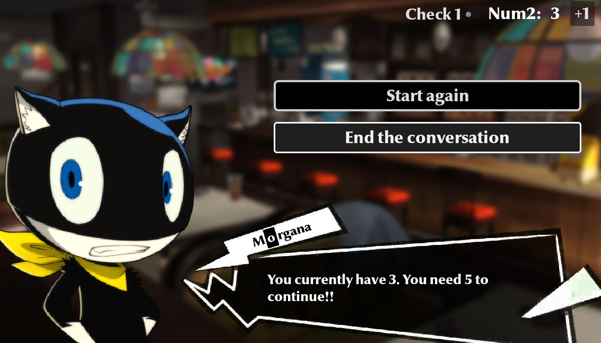
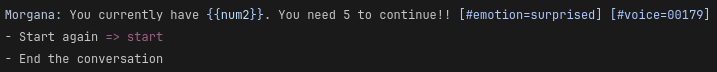
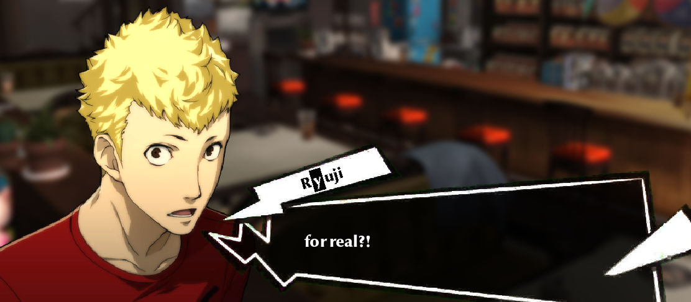
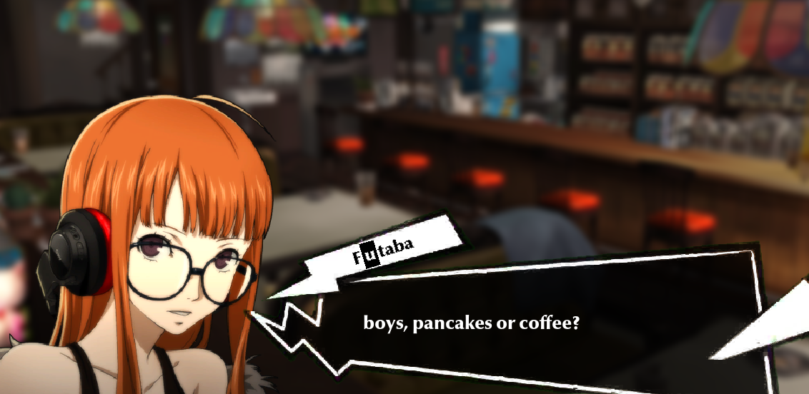
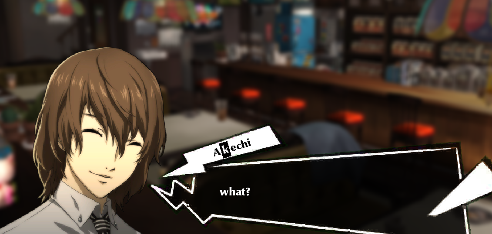

# P5R Dialogue System
persona 5 themed dialogue system integrated with nathan hoad's dialogue manager. basic emotions, sfx, and character/text animations are implemented.

display vs. script comparison:

  
  

examples of usage:

  
  
  

